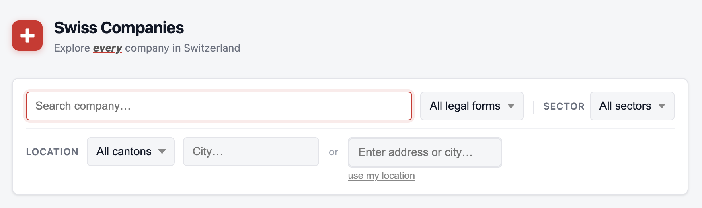

# Swiss Companies

Browse and search Swiss companies sourced from the [Zefix](https://www.zefix.admin.ch/) registry via the LINDAS SPARQL endpoint. This project enriches the raw data with:

- **English translations** of company descriptions
- **Hybrid search** — combining semantic (vector) and full-text search, in English
- **Sector classification** (NOGA) inferred from the description
- **Geolocation** extracted from company addresses
- **"Near me" filtering** — find companies within a given radius of your location



## Stack

- **Backend** — FastAPI + SQLAlchemy + PostgreSQL (pgvector)
- **Frontend** — React (Vite)
- **Data pipeline** — Python scripts orchestrated with `just`

## Prerequisites

- [uv](https://docs.astral.sh/uv/)
- [just](https://github.com/casey/just)
- [Docker Compose](https://docs.docker.com/compose/) (used to run PostgreSQL)


## Running locally

```bash
# 1. Start the database
docker compose up -d

# 2. Apply database migrations
just migrate

# 3. Fetch, process, and load data
# Note: on first run, downloads Switzerland OSM data and translation models from HuggingFace
just prepare-and-reload-subset   # ~1000 companies, fast (~minutes)
# just prepare-and-reload        # full dataset (~800k companies, slow ~2 days)

# 4. Start the API
just start-api   # API swagger at http://localhost:8000/docs
```

```bash
# 5. Start the UI on a separate terminal
just start-ui    # React dev server at http://localhost:5173/
```

## Known limitations

- **Translations** — descriptions are translated to English using a local MarianMT model, which produces mediocre quality. Replacing it with a larger model (e.g. a Claude or GPT-4 API call) would improve results significantly.
- **Sector classification** — companies are classified into NOGA sectors via sentence embedding similarity, which is brittle and often wrong. A prompted LLM would be more reliable.
